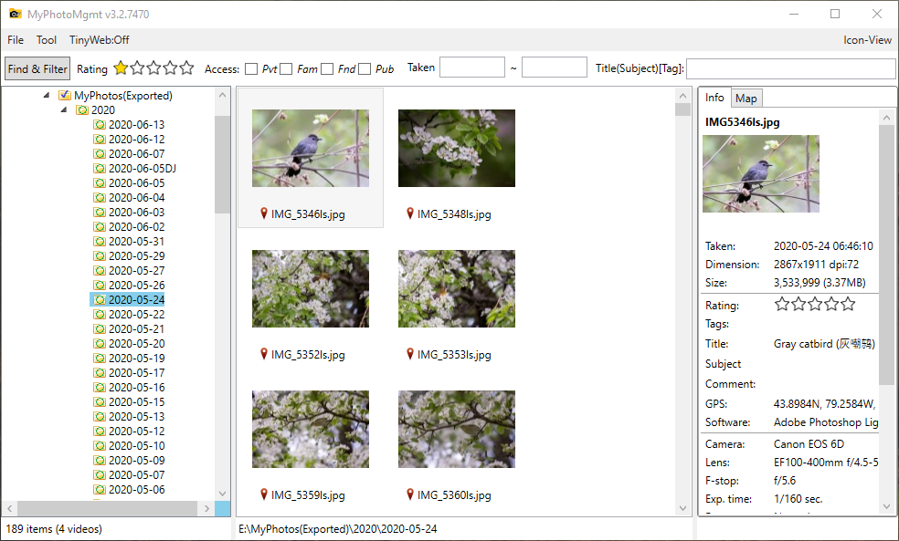

# MyPhotoMgmt - My Photo Management Tool #
Copyright (c) 2018-2020 Coronabo Code, nmgslx@gmail.com
Binary File for Windows (.NET 4.0 needed)

## How to setup your Bing Map API
* Get your API key
   1. Go to the [Bing Maps Dev Center](https://www.bingmapsportal.com/)
   2. Sign in to the Bing Maps Dev Center with your existing Microsoft Account or Create a new one
   3. Under "My account" menu, click "Create or view keys"
   4. Click the link to create your new key
   5. Set up your API key: Tools -> Settings  

## Third-part DLLs (included)
   * log4net.dll
   * Microsoft.Maps.MapControl.WPF.dll
   * Microsoft.WindowsAPICodePack.dll
   * Microsoft.WindowsAPICodePack.Shell.dll

## Version define
`ver 3.2.7620`

3 = major version, 
2 = minor version, 
7620 = build date (#days from 2000-01-01)

## Versions
* Version 2.0.0 release on 31-Dec-2018
* Version 2.0.1 release on 05-Jan-2019
* Version 3.0.0 release on 15-Jan-2020
* Version 3.0.7381 release on 17-March-2020
* Version 3.1.* Add TinyWeb Server
* Version 3.2.7471 Add Video support
* Version 3.2.7620 (1) Add FolderInfo (`.mymgmt.info`) with Markdown support (2) show folderinfo in TinyWeb
* Version 3.2.7629 (1) Fix the Tags/Subject etc. editing bug when selected photo changed (2) Using Left & Right arrow to select previous/next photo
* version 3.2.7698 for each folder, keep markdown text info in file .index.md and media folder is .mymgmt
* version 3.3.7720 (1) fix the browser buttons position issue when scroll the browser window (2) fix the search&filter bugs - "space in tags" and search for no condition (3) add tha boxes in image in browser (4) put search result to subfolder
* version 3.3.7838 added the function to play photo related audio (mp3) file, i.e., a .mp3 file with the same name of photo or part of fille name inside quare brackets [].

